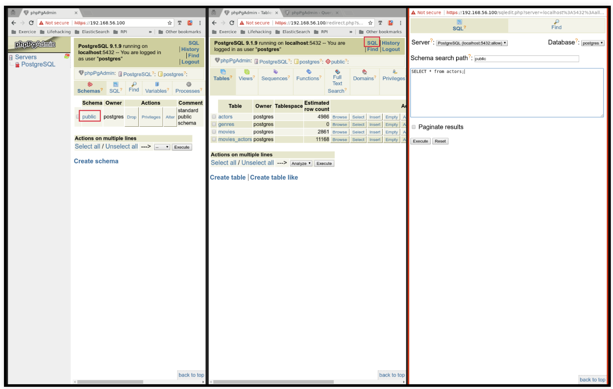

# <center><u> *TP1: NoSQL* </u></center>

#### Installations
1. Démarrez l’application Virtualbox
2. Configurez un réseau host-only vboxnet0
```
[clementtailleur]$ VBoxManage hostonlyif create
[clementtailleur]$ VBoxManage hostonlyif ipconfig vboxnet0 --ip 192.168.56.1
[clementtailleur]$ VBoxManage dhcpserver add --ifname vboxnet0 --ip 192.168.56.1\
           -netmask 255.255.255.0 --lowerip 192.168.56.100\
           --upperip 192.168.56.200
[clementtailleur]$ VBoxManage dhcpserver modify --ifname vboxnet0 --enable
```
3. Télécharger la VM  
[https://docs.google.com/uc?export=download&confirm=7QHs&id=0B6Df1Uxh_16cQUJzZXB4WkJyN28]()
4. Une fois la VM démarée *PostgreSQL.ova*, noter l’IP de PHPPgAdmin.
5. Accédez a l’interface web du PHPPgAdmin https://192.168.56.101/
6. Connectez vous avec ce login/pass
```
Login
User: postgres
Pass: bigdata14
```
7. Sélectionner le serveur PostgreSQL et la base de donnes postgres
8. Sélectionner le schema public , et ouvrir la fenetre SQL
9. Lancer une requete simple
```
SELECT * FROM ACTORS
```

#### Exemple visuel


#### Plus de détails sur l'installation (travail déjà fait)
1. Installation du client/serveur/extensions suplementaires
2. 	Initialisation de la base
3. Démarrage du serveur
4. Front-end requetage
5. Installation des extensions Verifier les extensions installées.

```
yum install postgresql postgresql-server postgresql-contrib (1)
postgresql-setup initdb (2)

systemctl start postgresql.service (3)

yum install pgadmin3   (4)

CREATE EXTENSION tablefunc; (5)
CREATE EXTENSION dict_xsyn;
CREATE EXTENSION fuzzystrmatch;
CREATE EXTENSION pg_trgm;
CREATE EXTENSION cube;
```


#### Introduction (travail déjà fait)
Le schéma de nos données.
```
CREATE TABLE genres (
        name text UNIQUE,
        position integer
);
CREATE TABLE movies (
        movie_id SERIAL PRIMARY KEY,
        title text,
        genre cube
);
CREATE TABLE actors (
        actor_id SERIAL PRIMARY KEY,
        name text
);

CREATE TABLE movies_actors (
        movie_id integer REFERENCES movies NOT NULL,
        actor_id integer REFERENCES actors NOT NULL,
        UNIQUE (movie_id, actor_id)
);

CREATE INDEX movies_actors_movie_id ON movies_actors (movie_id);
CREATE INDEX movies_actors_actor_id ON movies_actors (actor_id);
CREATE INDEX movies_genres_cube ON movies USING gist (genre);
```

## Travaux Pratiques
#### Recherche textuelle/patterns
1. Tous les films qui ont le mot stardust dans leur nom.
```
SELECT *
FROM movies
WHERE LOWER(title) LIKE '%stardust%'
```

2. Compter tous les films dont le titre ne commence pas par le mot **the**.
```
SELECT COUNT(*)
FROM movies
WHERE LOWER(title) NOT LIKE 'the %'
```

3. Tous les films qui ont le mot **war** dans le titre mais pas en dernière position.
```
SELECT *
FROM movies
WHERE LOWER(title) LIKE '% war %'
```

#### Distance Levenshtein
1. La distance levenshtein entre les mots **execution** et **intention**.
```
SELECT levenshtein('execution', 'intention');
```

2. Tous les films qui sont a une distance levenshtein inférieure a 9 de la chaine suivante: **a hard day nght**.
```
SELECT title, levenshtein(title, 'a hard day nght')
FROM movies
WHERE levenshtein(title, 'a hard day nght') > 9
ORDER BY levenshtein(title, 'a hard day nght') DESC
```

#### N-gram, similarity search (%)
1. Tous les tri-grammes du mot **Avatar**.
```
SELECT show_trgm('Avatar')
```

2. La similarité entre **VOTKA** et **VODKA**.
```
SELECT similarity('Votka', 'Vodka')
```

3. Tous les films dont le titre est similaire a plus de 0.1% du titre **Avatar**.
```
SELECT title, similarity(title, 'Avatar')
FROM movies
WHERE similarity(title, 'Avatar') > 0.1
```

#### Full text search
1. Trouver les filmes qui contiennent les formes grammaticales des mots **night** et **day**.
```
SELECT to_tsvector('A Hard Day''s Night'),
     to_tsquery('english', 'night & day');
```

#### Recherche phonétique
1. Trouver les films qui ont des acteurs dont les noms se prononcent pareil.
```
TO DO
```
2. Trouver les acteurs avec un nom similaire a **Robin Wiliams**, triés par similarité (combiner %, metaphone et levenshtein)
```
TO DO
```

#### Recherche multi-dimensionnelle
*Travail déjà fait.*  
On utilise le type cube <1> pour mapper les notes sur un vecteur n-dimensionnel de valeurs (= score du film <2>)
```
CREATE TABLE movies (
        movie_id SERIAL PRIMARY KEY,
        title text,
        genre cube (1)
);

INSERT INTO movies (movie_id,title,genre) VALUES
(1,'Star Wars',
'(0,7,0,0,0,0,0,0,0,7,0,0,0,0,10,0,0,0)') (2)
),
```
Les noms pour les dimensions sont définis dans la table genres
```
CREATE TABLE genres (
	name text UNIQUE,
	position integer
);

INSERT INTO genres (name,position) VALUES
('Action',1),
('Adventure',2),
('Animation',3),
...
('Sport',16),
('Thriller',17),
('Western',18);
```

*À faire.*  
› Utiliser le module cube pour recommander des filmes similaires (du même genre)

1. Afficher les notes du film **Star Wars**.
```
TO DO
```

2. Quelle est la note du film **Star Wars** dans la catégorie *Animation*.
```
TO DO
```

3. Afficher les films avec les meilleurs notes dans la catégorie *SciFi*.
```
TO DO
```

4. Afficher les films similaires (cube_distance) a **Star Wars** (vecteur = (0, 7, 0, 0, 0, 0, 0, 0, 0, 7, 0, 0, 0, 0, 10, 0, 0, 0) ) du plus similaire au moins similaire.
```
TO DO
```

5. Écrivez une requête pour trouver les films qui sont a moins de 5 points de différence sur chaque dimension (utiliser cube_enlarge et @> ).
```
TO DO
```
