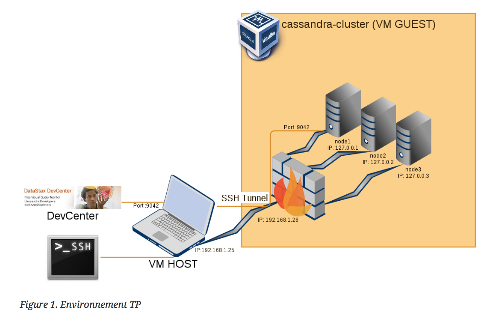

# <center><u> *TP2: NoSQL* </u></center>

#### Installations
1. Téléchargez la VM Cassandra_Cluster:
[https://docs.google.com/file/d/0B6Df1Uxh_16cZDhUV000THp1ZFE/edit]()
2. Importez cette VM dans votre VirtualBox
3. Lancez la VM **Cassandra_Cluster en réseau NAT**
4. Notez l’adresse IP affichée lors du démarrage
5. Si vous avez eu une adresse IP, l’installation s’est bien passé. Félicitations :)

#### Environnement


#### Connexion en ssh sur la machine
• utilisateur: bigdata  
• password: bigdatafuret
```
[clementtailleur ~]$ ssh bigdata@192.168.1.28
[bigdata@bigdata ~]$
```

#### Gestion du cluster via CCM
1. Lister les clusters installés sur votre machine. Notez le cluster actif qui est marqué par une étoile:
```
[bigdata@bigdata ~]$ ccm list
 *cassandra-2.1.16
  test
```

2. Activer le cluster test
```
[bigdata@bigdata ~]$ ccm switch test
[bigdata@bigdata ~]$ ccm list
  cassandra-2.1.16
 *test
```

3. Vérifier l’état du cluster active (test)
```
[bigdata@bigdata ~]$ ccm status
Cluster: 'test'
node1: DOWN
node3: DOWN
node2: DOWN
```

4. Démarrez le cluster
```
[bigdata@bigdata ~]$ ccm start
```

5. Vérifiez que le cluster a bien démarré et que les noeuds sont UP
```
[bigdata@bigdata ~]$ cmm status
```

6. Affichez les paramètres sur la configuration d’un noeud
```
[bigdata@bigdata ~]$ ccm node1 show
```

7. Exécutez la commande nodetool status sur un noeud. Observez l’état des noeuds, la charge, la distribution des clés et les intervalles des tokens.
```
[bigdata@bigdata ~]$ ccm node1 nodetool status
```

#### Configuration du cluster Cassandra
1. Regarder dans la configuration des noeuds quelles sont les valeurs pour les principaux
paramètres de configuration du cluster ( conf/cassandra.yaml). Repérer les paramètres essentiels, et
pour chaque paramètre expliquer à quoi il correspond et les valeurs usuelles (documentation)
```
[bigdata@bigdata ~]$ cat .ccm/test/node1/conf/cassandra.yaml
```

2. Quelles sont les intervalles de tokens pour chaque noeud du cluster ?
```
[bigdata@bigdata ~]$ ccm node1 nodetool status
```

#### Cohérence dans Apache Cassandra
1. Arrêtez le cluster de test et vérifiez qu’il s’est bien arrêté.  
Nous voulons créer un nouveau cluster qui peut subir la perte de 2 noeuds et continuer à avoir une cohérence forte.
```
[bigdata@bigdata ~]$ ccm stop
[bigdata@bigdata ~]$ ccm status
```
• Combien de noeuds nous sont nécessaires (on veut le minimum de noeuds) ?  
• Quel sera le niveau de replication (RF) nécessaire ?  
• Quel est le niveau de cohérence souhaité (ONE, ANY, QUORUM, ALL) pour les lectures et les écritures pour avoir une cohérence forte ?  
• Quelles sont les proprietés de votre cluster en terme d’espace disque, latence et cohérence des données ?  
• Créez et démarrez un tel cluster via CCM en utilisant la version 2.0.5 de Cassandra.
```
[bigdata@bigdata ~]$ ccm create Arsenal -v 2.0.5 -n 5 -s
```

2. Traçage des requêtes dans cqlsh
• Sur le cluster test lancez cqlsh (le shell de requêtage Cassandra) sur le noeud1
```
TO DO
```

• Affichez le contenu des tables system.schema_keyspaces et reponse.temperature1
```
cqlsh> SELECT * FROM system.schema_keyspaces;
cqlsh> SELECT * FROM reponse.temperature1;
```

• Dans cqlsh activez le mode de traçage (TRACING) des requêtes, re-exécutez les deux requêtes, observez les échanges entre les noeuds du cluster
```
cqlsh> TRACING ON
```

• La commande CONSISTENCY de cqlsh permet de connaître le mode de cohérence active et de le changer pour la session en cours
```
cqlsh:system_traces> CONSISTENCY
Current consistency level is ONE.
cqlsh> CONSISTENCY QUORUM
Consistency level set to QUORUM.
```

• Utiliser CCM pour arrêter l’un des noeuds du cluster, rejouer les deux requêtes précedentes à un
niveau de cohérence QUORUM, expliquer le résultat obtenu
```
TO DO
```
