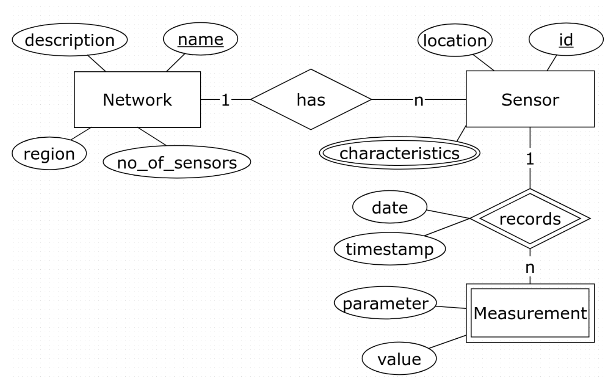
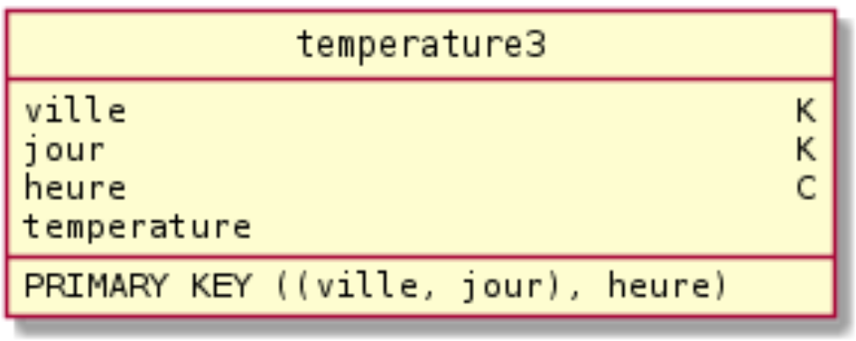

# <center><u> *TP3: NoSQL* </u></center>

## Installations
1. Télécharger la [VM](https://drive.google.com/file/d/1XJjcMWB8bIyGISkASbykfM1tfg7r9-MP/view) Spark/Cassandra/Neo4j
2. Lancer la VM Cassandra_Spark_Neo4j en **réseau privé hôte vboxnet0**.

## Primary key, partition key et clustering columns

1. Via ccm creez un nouveau cluster temperatures en spécifiant
la version de cassandra 3.0.15  
› Depuis le mac, quand la machine virtuelle est lancée:
````
[clementtailleur]$ ssh bigdata@192.168.56.101
[bigdata@bigdata ~]$ ccm create temperatures -v 3.0.15 -n 3 -s
````

2. Créez un keyspace temperature avec un RF de 3.
Créez une table temperature1 qui a deux colonnes (ville et temperature) et une clé primaire composée d’une seule colonne.  
Expliquez le choix de la clé primaire et ses impacts.  
Faire quelques insertions avec des valeurs de villes/temperatures différentes/identiques et tester quelles sont les requêtes supportées par cette table.
````
# On commencer par rentrer dans l'intérpréteur
# cqlsh via un noeud déterminé au hasard, dans notre cas, node1.
[bigdata@bigdata ~]$ ccm node1 cqlsh
````
````
# On créé un keyspace temperature avec un RF de 3
CREATE KEYSPACE temperature
WITH replication = {
'class': 'SimpleStrategy',
'replication_factor': 3
};
````
````
# Maintenant on précise à notre interpréteur qu'on
# utilise la KEYSPACE temperature.
USE temperature;
````
````
# On peut alors créer notre table
CREATE TABLE temperature1(
ville text,
temperature double,
PRIMARY KEY (ville)
);
````
````
# On prend la ville en PRIMARY KEY car la température
# a peu de chance d'être unique.
# On va maintenant y ajouter des données !  
INSERT INTO temperature1 (ville, temperature)
VALUES ('Paris', 15.5);
INSERT INTO temperature1 (ville, temperature)
VALUES ('Monaco', 25.7);
INSERT INTO temperature1 (ville, temperature)
VALUES ('Bordeaux', 22.2);
````
````
# Affichage des températures insérées
SELECT * FROM temperature1;
````

3. Pour comprendre le stocquage physique de Cassandra nous allons utiliser sstabedump pour avoir une representation des données qui sont dans les SSTables d’un noeud spécifique. Pour s’assurer que les memtables ont bien ete sauvegardées dans des sstables (donc persistés sur le disk) nous allons faire un ccm flush (qui va faire un nodetool flush sur tous les noeuds du cluster). Dans le cas des suppressions une compaction du keyspace peut etre nécessaire.
````
[bigdata@bigdata ~]$ ccm flush; ccm node1 nodetool compact temperature
[bigdata@bigdata ~]$ .ccm/repository/3.0.15/tools/bin/sstabledump .ccm/temperatures/node1/data/temperature/temperature1-27879ec0cea311e788721b0b0ebdb476/mc-2-big-Data.db
````

4. Nous voulons changer cette modélisation pour pouvoir récupérer les temperatures enregistrées dans une ville donnée pour les deux derniers jours disponibles (avec la donnée la plus fraîche en premier). Créez une nouvelle table temperature2 qui a une colonne de plus → record_date de type text dans laquelle on va stocker la date des relevés de temperature. Quelle est la modélisation qui ne permettra de répondre a notre besoin? Créer cette table, insérez quelques valeurs et écrivez la requete demandée. Utiliser sstabledump pour explorer le stocquage physique.
````
USE temperature;
CREATE TABLE temperature2 (
  ville text,
  record_date text,
  temperature double,
  humidity double,
  PRIMARY KEY (ville, record_date)
) WITH CLUSTERING ORDER BY (record_date DESC) ;
INSERT INTO temperature2 (ville, record_date, temperature)
VALUES ('Lille', '2017/11/08', 5.1);
INSERT INTO temperature2 (ville, record_date, temperature)
VALUES ('Londres', '2017/09/10', 12.7);
INSERT INTO temperature2 (ville, record_date, temperature)
VALUES ('Caen', '2016/12/31', 10.2);
INSERT INTO temperature2 (ville, record_date, temperature)
VALUES ('Caen', '2017/11/14', 11.3);
````
<font color="darkred">Question 4 à finir..</font>

5. Le modèle precedent est bien meilleur car on peut insérer 1 température par jour, sans écraser la précédente. Cependant, on ne pourra pas stocker plus de 2 milliards de valeurs pour la meme ville. Nous nous rendons compte aussi qu’on commence a avoir des partitions trop grosses pour certaines villes. Créez une nouvelle table pour palier a ces problèmes en permettant le requetage de la temperature heure par heure pour un jour donné.
```
TO DO
```

## Modélisation
Dans cette partie nous allons écrire les requêtes pour modéliser un systeme qui gère les données produites par un réseau de capteurs. Nous allons utiliser l’approche décrite [ici](http://www.cs.wayne.edu/andrey/papers/bigdata2015.pdf) et utilisée par [KDM](http://kdm.dataview.org/).

Nous avons fait une premiere étape d’analyse des besoins et on a construit le modéle conceptuel avec les entités, leurs attributes et leurs clefs ainsi que les relations entre entités (rectangle = entité, cercle = attribut, dimant=relation, double rectangle/diamant = entite faible, double cercle = collection).


Les principales requêtes auxquelles notre modélisation devrait pouvoir répondre sont:

**Q1**: Trouver tous les paramètres des capteurs d’un réseau donné
**Q2**: Trouver tous les relevées d’un capteur donné pour un jour donneé. Afficher les résultats comme une liste triée en ordre décroissante sur le timestamp  
**Q3**: Trouver toutes les mesures (parameter, value) d’un capteur donne. Trier les résultats par l’heure de l’enregistrement (décroisant).

1. **Modélisation logique**: Créez un ensemble des tables Cassandra en spécifiant pour chaque table le nom des attributes et les propriétés (cle primaire, cle de partition, colonne de clustering.
Par exemple le modèle logique suivant correspond a notre table temperature3 définie précédemment (Legende: K = partie de la cle de partition, C = clustering column, S = static column)

```
TD DO
```

2. **Modélisation physique**: Écrire les requêtes CQL pour créer les tables qui correspondent au modéle logique precedement défini (prenez en compte les contraintes exposes en cours sur la taille des partition, des colonnes etc..). Traduire en CQL les requêtes presentées dans l’expression des besoins.
```
TO DO
```
