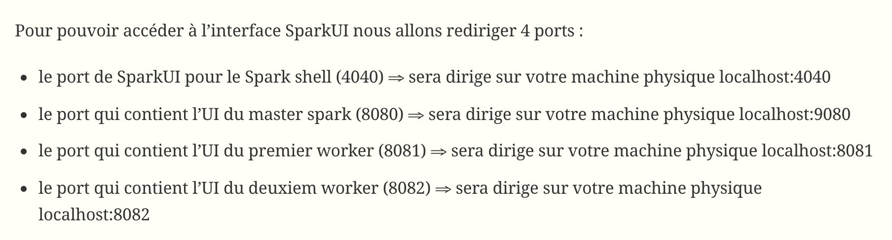

# <center> <u>TP Spark n°4</u> </center>

## Installations
1. Télécharger la [VM](https://drive.google.com/file/d/1XJjcMWB8bIyGISkASbykfM1tfg7r9-MP/view) Spark/Cassandra/Neo4j
2. Lancer la VM Cassandra_Spark_Neo4j en **réseau privé hôte vboxnet0**.


#### Introduction
Pour le TP Spark vous allez utiliser une machine virtuelle qui contient un cluster Cassandra de 3 noeuds ainsi que Apache Spark. Le cluster Spark est composé d’un master et d’un noeud worker avec deux executeurs ( documentation deployement standalone) Vous allez vous connecter a cette machine via ssh.

1. Connectez vous en ssh sur la VM depuis votre machine physique (un terminal linux/ putty sous windows). On profite pour rediriger les ports locaux de votre machine physique vers les ports de la VM.  
• utilisateur: bigdata  
• password: bigdatafuret
```
val data = 1 to 1000;
val paralelizedData= sc.parallelize(data);
```

#### Demarrage du cluster Spark
Chaque application Spark utilise un programme driver qui sert a lancer des calculs distribués sur un cluster. Ce programme définit les structures de données distribuées dans le cluster ainsi que le DAG d’opérations sur ces structures de données. Un noeud coordinateur (appele aussi master) lancera ces operations sur deux noeuds Worker qui hebergeront un/plusieurs executeur(s).

1. Rajouter dans le script de configuration de l’environement spark (conf/spark-env.sh) la ligne export SPARK_WORKER_INSTANCES=2 puis démarrer le master et les workers via le script spark-2.0.2-bin-hadoop2.7/sbin/start-all.sh
```
[bigdata@bigdata ~]$[bigdata@bigdata ~]$ cat spark-2.0.2-bin-hadoop2.7/conf/spark-env.sh | grep SPARK_WORKER_INSTANCES
# Ajouter dans spark-env.sh: export SPARK_WORKER_INSTANCES=2
```

2. Démarrer le master Spark et les Workers
```
[bigdata@bigdata ~]$ spark-2.0.2-bin-hadoop2.7/sbin/start-all.sh
```

3. Connexion via le spark-shell
```
[bigdata@bigdata ~]$ spark-2.0.2-bin-hadoop2.7/bin/spark-shell\
                            --master spark://bigdata:7077
```


#### Spark-Shell / Exercice Scala
A. Définir une variable immutable(val) de type List[Int]
B. Définir une fonction qui prend en entrée un entier et retourne le cube  
C. Utiliser la fonction map pour appliquer un traitement (ici la fonction cube est appliquée à chaque element de la liste)  
D. Utilisation d’une fonction anonyme pour faire le même traitement  
E. Definition d’une fonction Int→Boolean qui retourne si un nombre est paire  
F. On transforme la liste des entiers dans une liste de booleans
G. La même chose qu’avant mais en utilisant une écriture plus compacte  
H. Filtrage des numéros paires de la liste
I. Dans le shell on peut utiliser l’aide via la touche TAB. Ecrire myNumbers.foldLeft puis appuyer sur TAB permet d’afficher la signature de la function foldLeft de scala. Elle prend deux listes d’arguments ⇒ un élèment neutre de type B et une fonction f: (B, A) ⇒ B  
J. Utilisation de foldLeft pour calculer la somme des élèments de la liste
```
scala> val myNumbers = List(1, 2, 5, 4, 7, 3)
myNumbers: List[Int] = List(1, 2, 5, 4, 7, 3)

scala> def cube(a: Int): Int = a * a * a
cube: (a: Int)Int

scala> myNumbers.map(x => cube(x))
res2: List[Int] = List(1, 8, 125, 64, 343, 27)

scala> myNumbers.map{x => x * x * x}
res3: List[Int] = List(1, 8, 125, 64, 343, 27)

scala> def even(a:Int):Boolean = { a%2 == 0 }
even: (a: Int)Boolean

scala> myNumbers.map(x=>even(x))
res4: List[Boolean] = List(false, true, false, true, false, false)

scala> myNumbers.map(even(_))
res5: List[Boolean] = List(false, true, false, true, false, false)

scala> myNumbers.filter(even(_))
res6: List[Int] = List(2, 4)

scala> myNumbers.foldLeft

def foldLeft[B](z: B)(f: (B, A) => B): B

scala> myNumbers.foldLeft(0)(_+_)
res10: Int = 22
```


1. Ecrire une courte séquence Scala/Spark qui affiche la somme des nombres paires et divisibles par 13 de 1 a 1000 (utilisez la fonction fold disponible sur un RDD qui est similaire a foldLeft de scala).<br>
```
scala> val data = 1 to 1000
scala> val filteredData = data.filter(n=> (n%2==0) && (n%13==0));
scala> parDataCached.fold(0)((x,y)=>x+y);
```

2. Lancer l’action (collect) qui va déclencher le traitement parallèle et va retourner le résultat Suivre dans le UI l’execution de votre script Spark http://localhost:4040.
```
scala> filteredData.collect
```

3. Écrire une courte séquence Scala/Spark qui affiche le produit des nombres paires de 1 a 1000.
```
parDataCached.fold(0)((x,y)=>x+y);
# Attention ne marche pas avec une séquence trop grande
# car integer codés seulement sur 32 bits
```

4. Écrire une courte séquence Scala/Spark qui affiche le produit des nombres paires de 1 a 1000.
```
parDataCached.fold(1)((x,y)=>x*y);
# Attention ne marche pas avec une séquence trop grande
# car integer codés seulement sur 32 bits
```

5. Combiner les deux derniers programmes en un seul. Mettre en cache les données au niveau des noeuds et vérifier la répartition des ces données via le Spark UI
```
# Définition d’un RDD qui va stocquer tous les nombres paires sur les noeuds
scala> val parDataCached = sc.parallelize(1 to 1000).filter(_%2==0).cache  
parDataCached: org.apache.spark.rdd.RDD[Int] = FilteredRDD[6] at filter at <console>:13
scala> parDataCached.fold(0)(_+_)  
res7: Int = 250500
```

6. WordCount: écrire le programme pour compter l’occurence des mots du fichier *'/home/bigdata/spark-2.0.2-bin-hadoop2.7/README.md'*
```
val textFile = sc.textFile("/home/bigdata/spark-2.0.2-bin-hadoop2.7/README.md")
val counts = textFile.flatMap(line => line.split(" "))
                 .map(word => (word, 1))
                 .reduceByKey(_ + _)
counts.collect
```

7. Écrire le programme qui donne le mot le plus souvent utilisé du fichier (vous pouvez utiliser sortByKey après avoir inversé la liste des paires (mot,nb_occurences)). Suivez via le SparkUI les stage d’executions de votre traitement (http://localhost:4040/)
```
TO DO
```

#### SparkSQL
Utiliser SparkSQL pour trouver dans le fichier */home/bigdata/spark-2.0.2-bin-hadoop2.7/examples/src/main/resources/people.txt* les noms des personnes qui ont moins de 19 ans
```
# Création d’un contexte SQLContext
val sqlContext = new org.apache.spark.sql.SQLContext(sc)

# Définition du modèle de données en utilisant une case classe Scala
case class Person(name: String, age: Int)

# Création d’un dataframe Spark a partir d’un RDD
val people = sc.textFile("/home/bigdata/spark-2.0.2-bin-hadoop2.7/examples/src/main/resources/people.txt").map(_.split(",")).map(p => Person(p(0), p(1).trim.toInt)).toDF

# Enregistrement du dataframe dans une table temporaire
people.createOrReplaceTempView("people")

# Requêtage sur la table
val teenagers = sql("TODO")

# Le résultat d’une requête SparkSQL est un DataFrame
teenagers.show
```

#### Spark & Cassandra
Démarrer votre cluster Cassandra et vérifier qu’il est démarré:
```
[bigdata@bigdata ~]$  ccm status; ccm start; ccm status
Cluster: 'cassandra-2.1.16'
---------------
node1: DOWN
node3: DOWN
node2: DOWN
Cluster: 'cassandra-2.1.16'
---------------------------
node1: UP
node3: UP
node2: UP
```

Pour se connecter a Cassandra depuis le shell Spark il faut arrêter le shell (Ctrl+C or Ctrl+D) puis le redémarrer en ajoutant en paramètre l’adresse d’un noeud Cassandra et la dependence vers le connecteur spark-cassandra:
```
[bigdata@bigdata ~]$ spark-2.0.2-bin-hadoop2.7/bin/spark-shell --master spark://bigdata:7077  --conf spark.cassandra.connection.host=127.0.0.1 --packages datastax:spark-cassandra-connector:2.0.0-M2-s_2.11
```

**› WordCount avec Spark et Cassandra**
```
# Importer toutes les classes du pacakge com.datastax.spark.connector.
scala> import com.datastax.spark.connector._
import com.datastax.spark.connector._

# Créer un RDD a partir de la table de temperatures.
scala> val rdd = sc.cassandraTable("temperature", "temp1")
rdd: com.datastax.spark.connector.rdd.CassandraTableScanRDD[com.datastax.spark.connector.CassandraRow] = CassandraTableScanRDD[0] at RDD at CassandraRDD.scala:18

# Collecter le RDD et afficher les temperatures
scala> rdd.collect
res0: Array[com.datastax.spark.connector.CassandraRow] = Array(CassandraRow{ville: Paris, date: 2016-12-01 00:00:00+0100, temperature: 4}, CassandraRow{ville: Rennes, date: 2016-12-01 00:02:00+0100, temperature: 8}, CassandraRow{ville: Rennes, date: 2016-12-01 00:01:00+0100, temperature: 7}, CassandraRow{ville: Paris, date: 2016-12-01 00:02:00+0100, temperature: 6}, CassandraRow{ville: Rennes, date: 2016-12-01 00:00:00+0100, temperature: 6}, CassandraRow{ville: Paris, date: 2016-12-01 00:01:00+0100, temperature: 5})

# Import de la classe CassandraConnector du package cql
scala>import com.datastax.spark.connector.cql.CassandraConnector

# Créer un nouveau keyspace et une nouvelle table
scala>CassandraConnector(sc.getConf).withSessionDo { session =>
    session.execute(s"CREATE KEYSPACE IF NOT EXISTS demo WITH REPLICATION = {'class': 'SimpleStrategy', 'replication_factor': 1 }")
    session.execute(s"CREATE TABLE IF NOT EXISTS demo.wordcount (word TEXT PRIMARY KEY, count COUNTER)")
    session.execute(s"TRUNCATE demo.wordcount")
  }

# Créer un RDD avec les occurence des mots du fichier README.md
scala>val rdd= sc.textFile("/home/bigdata/spark-2.0.2-bin-hadoop2.7/README.md").flatMap(_.split("[^a-zA-Z0-9']+")).map(word => (word.toLowerCase, 1)).reduceByKey(_ + _).filter(x => x._1!="")

scala>rdd.collect.foreach(println(_))

# Sauver ce RDD dans la table Cassandra wordcount
scala> rdd.saveToCassandra("demo","wordcount")

# Afficher le contenu de la table wordcount
scala> sc.cassandraTable("demo", "wordcount").collect
```
